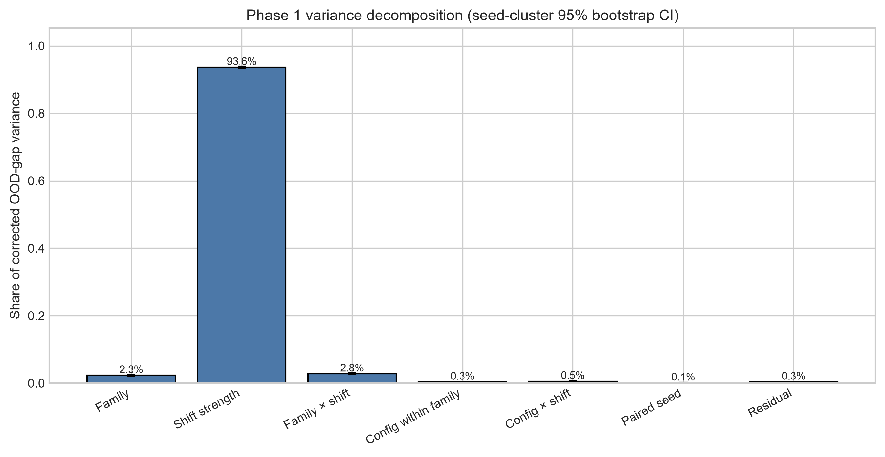
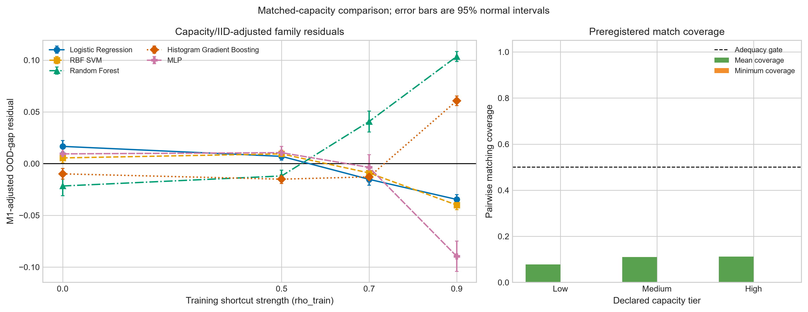
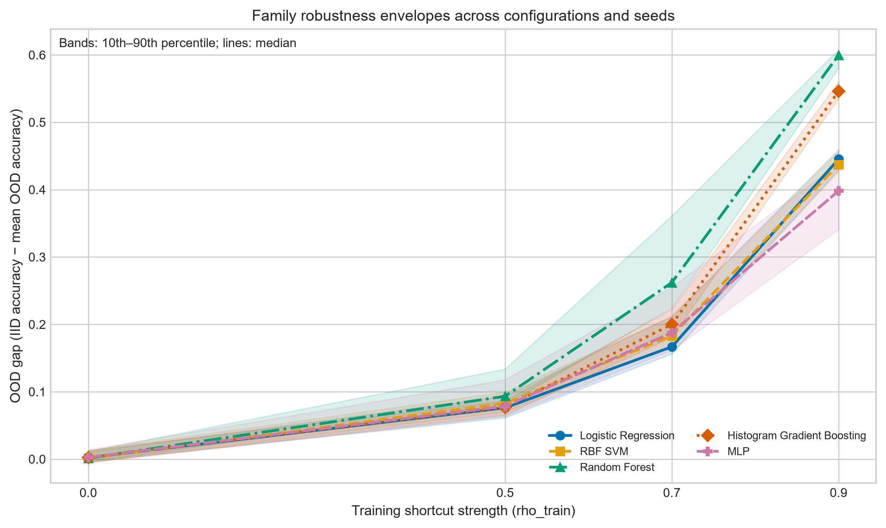
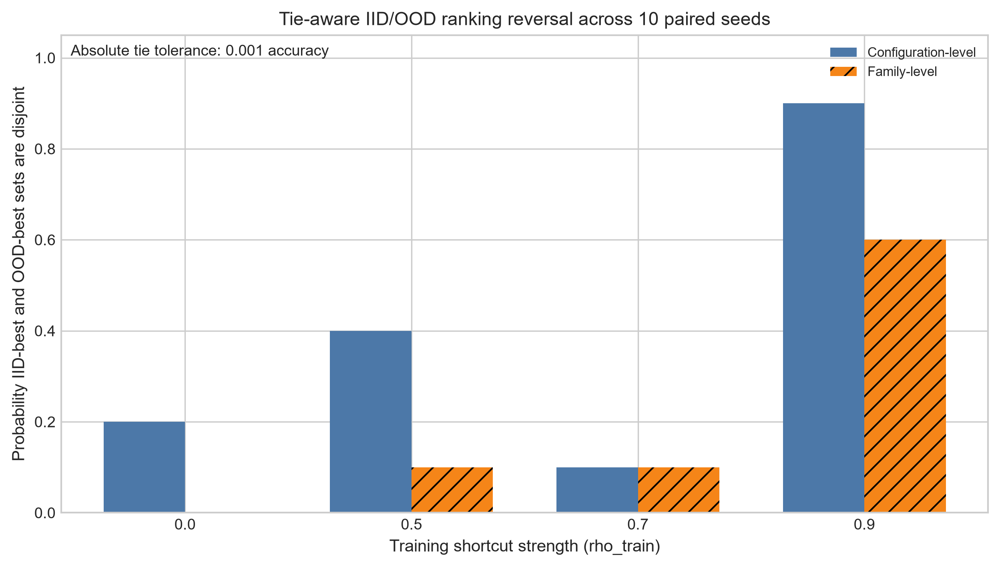
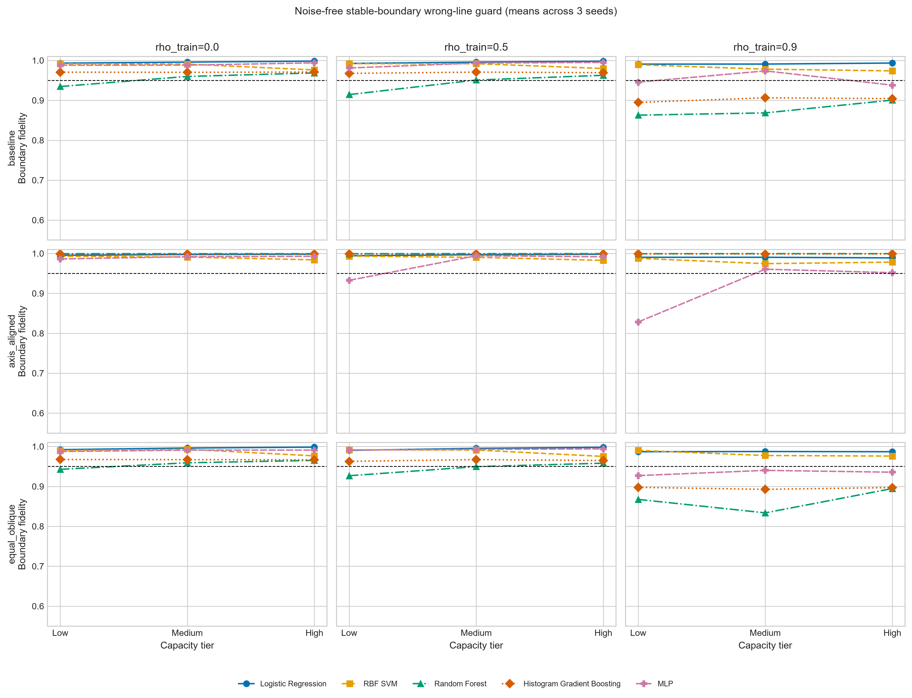

# Phase 1 Results — Family, Capacity, and Robustness Under Distribution Shift

Experiment ID: `PHASE1-FAMILY-CAPACITY`  
Frozen configuration SHA-256: `7f012f1f170e3bffd953334eeca4e1422f1dc54aaed46e3a79646da9645c852a`  
Master results SHA-256: `921ec932d337d58ccf420ea2e0116cf80cbc8f28d27f7f97de2c18887f0008c9`

## Result first

**Phase 1 supports G4a-C: the remaining family signal is regime-dependent and method-dependent, not a stable family residual.** The mandatory decision is **REVISE HYPOTHESIS**.

Training shortcut strength explained 93.63% of corrected OOD-gap variance. Model family explained 2.30%, while family × shortcut-strength interaction explained 2.77%. After IID accuracy, measured empirical capacity, nominal regularization, rho, and paired seed controls, adding family improved leave-one-seed-out CV R² by 0.0156—statistically detectable in the seed bootstrap, but below the preregistered 0.05 practical threshold. Adding family × rho improved CV R² by a larger 0.0279. Capacity matching was too sparse to support a stable family claim and its prespecified stratified fallback also stayed well below the practical threshold.

This is not G4a-A because the family term was not statistically negligible: its in-sample incremental R² bootstrap interval was 0.0103–0.0139 and it reduced CV RMSE by 15.3%. It is not G4a-B because the family increment was too small, interaction dominated, leave-one-rho stability failed, and matched/stratified evidence did not reach the practical criterion.

## Study completion and data quality

- Planned/completed fits: 600 / 600.
- Planned/completed long result rows: 3,450 / 3,450.
- Model or metric failures: 0.
- Duplicate fit IDs, row IDs, or scientific keys: 0.
- Maximum OOD-gap reconstruction error: `3.19e-16`.
- Capacity tier order: strictly increasing for all five family-native proxies.
- Maximum requested-versus-realized shortcut-correlation error: 0.0773.
- Positive-rate range: 0.4765–0.5167.
- Maximum absolute independent-noise target correlation: 0.0536.
- High-capacity neutral-rho wrong-line fidelity: 0.9778–0.9983 across families; all above the 0.95 gate.

The only captured fit warning was a Windows/joblib inability to query physical CPU count; execution continued with 16 logical CPUs. It was not a convergence or model warning.

## Frozen design in brief

The experiment crossed five existing families with three configurations per family, four training shortcut regimes, and ten paired seeds. Each fit used the same five features and was evaluated on an independent IID test plus the frozen OOD environments. OOD inputs were unreachable from the fitting API. The 15-configuration design varied both structural and regularization settings; every model exported its family-native raw capacity measurements and a training-only, within-family/rho empirical capacity rank.

The primary fit-level outcome was:

`OOD gap = IID test accuracy − mean frozen-environment OOD accuracy`.

## Variance decomposition

| Component | Variance share | Seed-bootstrap 95% CI |
|---|---:|---:|
| Training shortcut strength | 0.9363 | 0.9331–0.9394 |
| Family × shortcut strength | 0.0277 | 0.0262–0.0297 |
| Model family | 0.0230 | 0.0208–0.0253 |
| Configuration × shortcut strength | 0.0054 | 0.0049–0.0065 |
| Configuration nested in family | 0.0033 | 0.0030–0.0038 |
| Residual | 0.0034 | 0.0023–0.0039 |
| Paired seed | 0.0009 | 0.0001–0.0018 |

The family share is not an adjusted causal effect. It is an orthogonal balanced-design marginal component. Its key comparison is that interaction exceeds family main effect, which points away from a single stable family ordering.

## Regression control and stability

| Model | In-sample R² | Leave-one-seed-out CV R² | CV RMSE |
|---|---:|---:|---:|
| M0: rho + paired seed | 0.9372 | 0.9359 | 0.0476 |
| M1: M0 + IID + capacity + regularization | 0.9488 | 0.9445 | 0.0443 |
| M2: M1 + family | 0.9613 | 0.9602 | 0.0375 |
| M3: M2 + family × rho | 0.9906 | 0.9881 | 0.0206 |

Primary comparisons:

- Family incremental in-sample R²: 0.0125; seed-bootstrap 95% interval 0.0103–0.0139.
- Family incremental CV R²: 0.0156, below the 0.05 practical threshold.
- Family CV RMSE reduction: 15.3%; every held-out seed showed lower M2 than M1 squared error.
- Family × rho incremental CV R²: 0.0279, larger than the family main increment.
- Minimum leave-one-rho family incremental CV R²: 0.0086 when `rho=0.9` was excluded, below the preregistered 0.03 stability requirement.

Sensitivity results did not rescue a stable family claim:

| Sensitivity | Family incremental CV R² | Interaction incremental CV R² |
|---|---:|---:|
| Primary empirical capacity + IID | 0.0156 | 0.0279 |
| Without IID accuracy | 0.0229 | 0.0276 |
| Declared capacity tier instead of empirical rank | 0.0156 | 0.0279 |
| Without nominal regularization score | 0.0160 | 0.0278 |

The positive but small family increment is therefore not just an artifact of the selected capacity proxy, IID covariate, or nominal regularization score. Its instability by rho remains the stronger fact.

## Capacity matching and fallback

The preregistered caliper was deliberately strict. Pairwise matching coverage averaged 10%; only 2 of 120 family-pair × rho × capacity-tier strata reached the 50% adequacy threshold. One adequate contrast, HGB minus MLP at neutral rho/high capacity, was 0.0119 (95% CI 0.0081–0.0148), below the 0.02 practical threshold. The other adequate contrast crossed zero. No eligible matched contrast met both the 0.02 magnitude and non-zero interval requirements.

Because coverage failed, the prespecified stratified regression fallback was used. Replacing the empirical rank with declared capacity tier yielded a family incremental R² of 0.0125 and CV increment 0.0156, again below 0.05.

Matching failure is evidence about design overlap, not evidence of no family effect. It limits how strongly Phase 1 can separate family from family-specific capacity and regularization semantics.

## Robustness envelopes and regime dependence

Mean OOD gap by family:

| rho_train | LR | RBF SVM | RF | HGB | MLP |
|---:|---:|---:|---:|---:|---:|
| 0.0 | 0.0031 | 0.0033 | 0.0028 | 0.0033 | 0.0026 |
| 0.5 | 0.0764 | 0.0859 | 0.1031 | 0.0771 | 0.0851 |
| 0.7 | 0.1790 | 0.1892 | 0.2833 | 0.2024 | 0.1970 |
| 0.9 | 0.4437 | 0.4401 | 0.5961 | 0.5468 | 0.3926 |

At rho 0, all five families were nearly indistinguishable in mean gap. At rho 0.5, LR/HGB were lowest. At rho 0.7, LR was lowest while RF degraded much more. At rho 0.9, MLP was lowest and RF/HGB were highest. The changing separation and ordering are exactly what the family × rho component and adjusted residual curves capture.

Within-family configurations still mattered. Examples include RF-L versus RF-H mean gaps of 0.3584 versus 0.2283 at rho 0.7, and MLP-L versus MLP-H of 0.3576 versus 0.4206 at rho 0.9. A family label alone does not identify a robust configuration.

## IID/OOD ranking reversal

Tie-aware probability that IID-best and average-OOD-best sets were disjoint:

| rho_train | Configuration level | Family level |
|---:|---:|---:|
| 0.0 | 0.20 | 0.00 |
| 0.5 | 0.40 | 0.10 |
| 0.7 | 0.10 | 0.10 |
| 0.9 | 0.90 | 0.60 |

Ranking reversal is therefore concentrated in the strongest shortcut regime. This replicates the broad EXP-002V observation that reversals are not uniformly stable across regimes, while showing that configuration diversity further raises reversal at rho 0.9.

## Noise-free wrong-line guard

Every high-capacity family cleared the neutral-rho 0.95 gate. The main results are therefore not explained by a gross inability of high-capacity models to recover the stable linear boundary when the shortcut is absent.

At positive rho, boundary fidelity became family-, geometry-, and capacity-dependent. The minimum observed cell was 0.7223 for low-capacity MLP on the axis-aligned geometry at rho 0.9; several RF/HGB cells were also below 0.90 under strong shortcut. These are diagnostic interactions, not a failed neutral-rho gate. They reinforce the revised hypothesis that learned boundary distortion depends on family × regime × capacity/geometry.

## Reviewer sensitivity — common OOD environments

The primary outcome averages four OOD environments for `rho_train=0` and five for positive rho because an IID-duplicate environment is excluded. A post hoc Reviewer-2 sensitivity recomputed every gap on the common set `{-0.9,-0.6,-0.3,0.3}`.

The result was nearly unchanged: family incremental CV R² 0.0151, interaction incremental CV R² 0.0273, variance shares 2.28% family, 2.70% family × rho, and 93.67% rho. G4a-C is therefore not an artifact of unequal OOD environment counts. This analysis is clearly post hoc and does not replace the preregistered primary result.

## What the evidence supports

- Shortcut strength is the dominant predictor of OOD degradation in this generator.
- Family contributes a reproducible but practically small residual after the measured controls.
- The family residual changes materially with shortcut regime; interaction is larger than the stable family main component.
- IID/OOD ranking reversal is much more common under the strongest shortcut.
- Capacity and configuration matter within family, but the 15-point grid does not provide sufficient cross-family overlap for strong matched causal language.

## What the evidence does not support

- No universal ranking of the five families.
- No claim that family causes robustness or fragility.
- No claim that the empirical capacity rank is a universal capacity unit.
- No claim that Phase 2 learned-bias isolation is justified under the frozen G4a-B rule.
- No generalization beyond this synthetic label-conditional shortcut shift.

## Decision

G4a-C: family differences are primarily regime-dependent under the available controls. Reframe the next hypothesis around `family × shortcut regime × capacity/geometry`, and improve cross-family overlap before any mechanism-isolation experiment.

REVISE HYPOTHESIS
